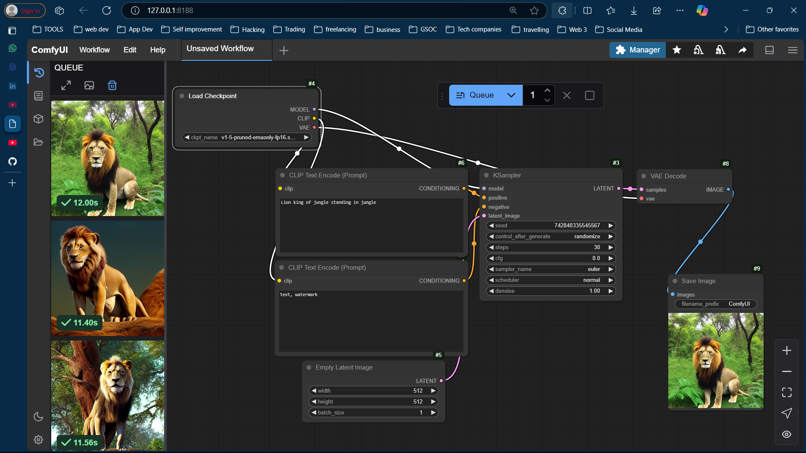
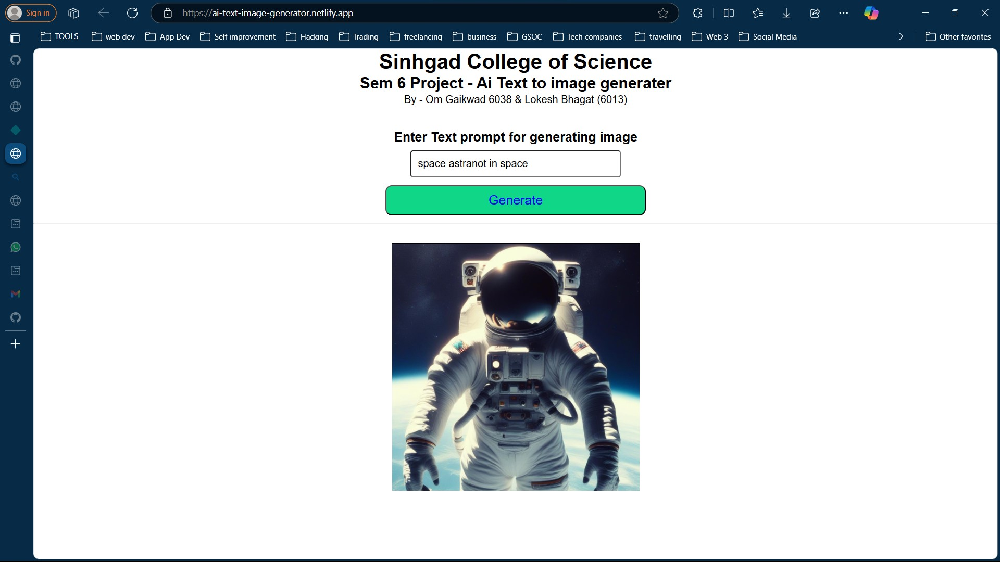

# AI Image Generation Using Diffusion Model

## Project Summary
This project focuses on generating high-quality images using **Diffusion Models**, a state-of-the-art approach in generative AI. The implementation leverages deep learning frameworks like **PyTorch** or **TensorFlow** to create and train diffusion models for image synthesis. The project includes a user-friendly interface for generating images and supports customization of model parameters.

### Key Features:
- **Diffusion Model Implementation**: Utilizes a denoising diffusion probabilistic model (DDPM) for image generation.
- **Customizable Parameters**: Adjust parameters like noise levels, image resolution, and sampling steps.
- **User-Friendly Interface**: Includes a GUI for easy interaction with the model.
- **Pre-Trained Models**: Supports loading pre-trained models for quick image generation.

---

## Workflow Image --> 
.

## Some Sample Images -->

---
# User Requirements

### Hardware Requirements
- **GPU**: NVIDIA GPU with at least 8 GB VRAM (recommended for training and inference).
- **CPU**: Modern multi-core processor (Intel i7/i9 or AMD Ryzen 7/9).
- **RAM**: 16 GB or more.
- **Storage**: SSD with at least 20 GB of free space.

## Software Requirements
- **Python** 3.8+
- **Deep Learning Framework**:
  - PyTorch or TensorFlow (with GPU support)
- **NVIDIA GPU Dependencies**:
  - CUDA

